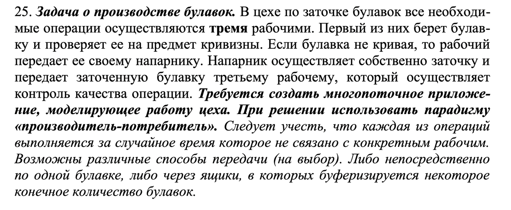
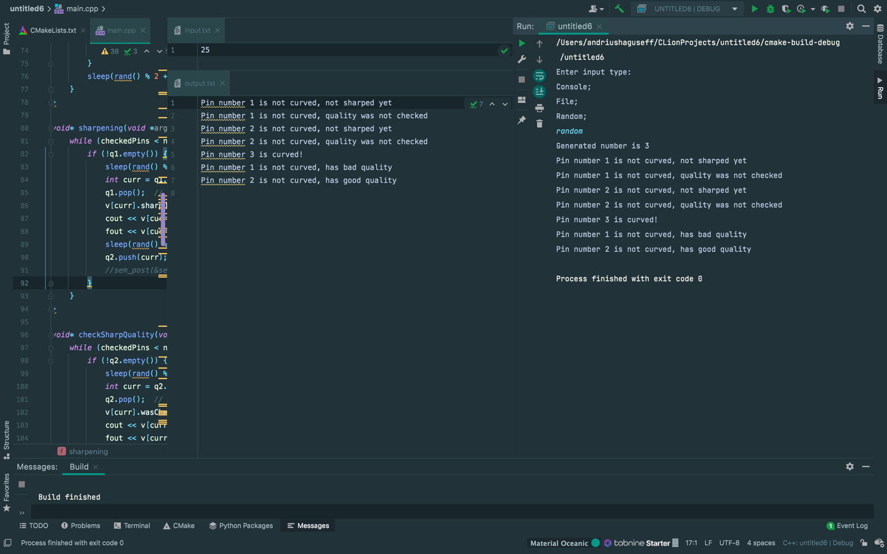

# ИДЗ №1 Андрей Гусев БПИ219

# Вариант #25

###Критерий №4/10

- В проекте это файл `main.cpp`

---

- **Производители и потребители** – это парадигма взаимодействующих неравноправных процессов. Одни из процессов «производят» данные, другие их «потребляют». Часто такие процессы организуются в конвейер, через который проходит информация. Каждый процесс конвейера потребляет выход своего предшественника и производит входные данные для своего последователя. 

- Между производителем и потребителем существует однонаправленный поток информации. Такой вид межпроцессного взаимодействия не имеет аналогов в последовательном программировании, поскольку в последовательной программе только один поток управления, в то время как производители и потребители - независимые процессы со своими потоками управления и собственными скоростями выполнения.

- В данной задаче 2 производителя и 2 потребителя: 1 поток (проверяющий булавки на кривизну) - производитель, 2 поток (осуществляющий заточку) - производитель и потребитель одновременно, 3 поток (проверяющий заточку) - потребитель. Входными данными программы являектся число - количество булавок.

---

**Ограничения ввода:**

1) На вход подается 1 целое число от 1 до 25 включительно.
2) Управление вводом данных происходит с помощью команд: console(number из командной строки), file, random;
3) При использовании командной строки команды console не существует, вместо нее используется команда number и соответсвенно нужно еще одним аргументом передавать корректное число.

---

---

- Сделано

---

- Реализован ввод данных из консоли

- Сделал.

---

###Критерий №5/10

- Сделал

---

- Программа моделирует работу 3-х независимых мастеров:
1) Первый мастер проверяет кривизну каждой булавки, и если та не кривая - кладет ее в "ящик" второго мастера.
2) Второй мастер берет очередную булавку из ящика (который заполняет первый мастер) и производит заточку булавки. После заточки второй мастер кладет булавку в другой ящик - предназначенный третьему мастеру.
3) Третий мастер соответственно берет очередную булавку из своего ящика и осуществляет контроль качества булавки.

- Все мастера работают независимо друг от друга, и каждый мастер отдыхает между работой над очередной булавкой.

---
###Критерий №6/10

- Структура Pin описывает булавку.

- В программе используется 3 потока: 
1) Проверяет кривизну булавки (с помощью функции rand() мы выясняем кривая или нет), 
не кривые булавки помещаются в q1 - первую очередь, предназначенную для 2 потока. 
2) Производит заточку булавки - берет из очереди q1 булавку - производит заточку и помещает булавку в q2 - очередь, предназначенную для 3 потока.
3) Проверяет качество булавки - берет из очереди q2 булавку и проверяет качество.
- 3 потока работают параллельно друг с другом, 2 мутекса регулируют их работу (корректное обращение к переменным).
---

- Сделал

---

- Сделал

---

###Критерий №7/10

- Реализован файловый ввод вывод.
- Для ввода данных используется файл input.txt
- Для вывода данных используется файл output.txt

---

1

2

3

4

---

- Результаты работы программы выводятся на экран и записываются в файл.
- Подсказки и замечания пользователю не записываются в файл.
- На 4 скриншоте предыдущего пункта видно.

---

- Ввод данных с командной строки поддерживает все виды ввода.

---

- Сделал

---

###Критерий №8/10

- Есть возможность генерации случайных входных данных.

---

1

2

3

---

- Ввод данных с командной строки поддерживает все виды ввода.

---

- Сделал

---
###Критерий №9/10

- Если отключить мутексы, то программа может сработать некорректно на любых входных данных: 
работа 2-х потоков зависит от состояния переменных q1 и q2 (переменная checkedPins не ломает программу при отключении мутексов),
- При отключенных мутексах может возникнуть следующая ситуация: второй поток взял последнюю булавку из q1 - она стало пустой, но еще не успела положить ее в q2 - а она может быть тоже пустой;
В этом случае третий поток не обработает последнюю булавку.

---

- Сделал
